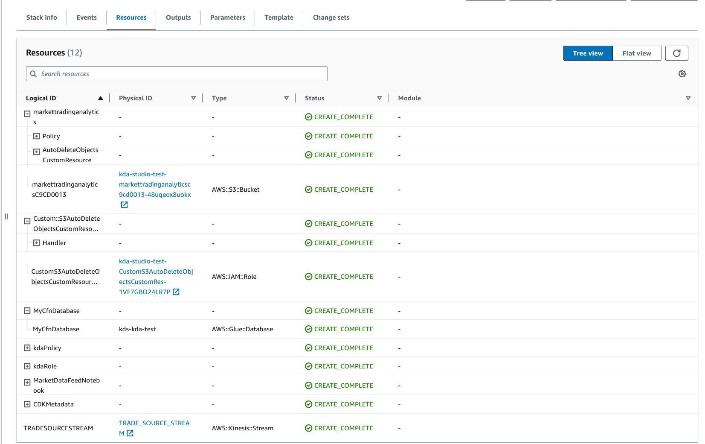
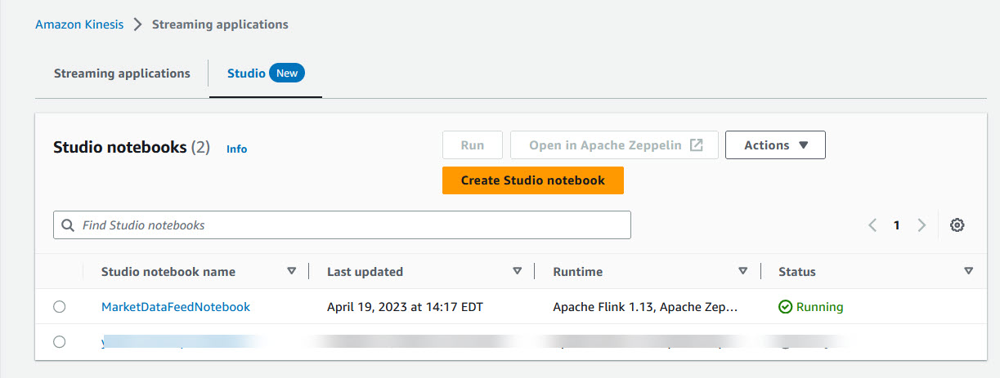
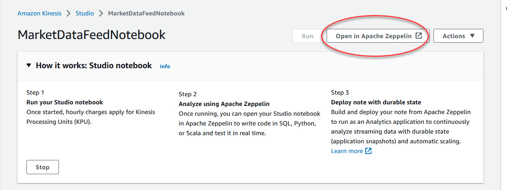
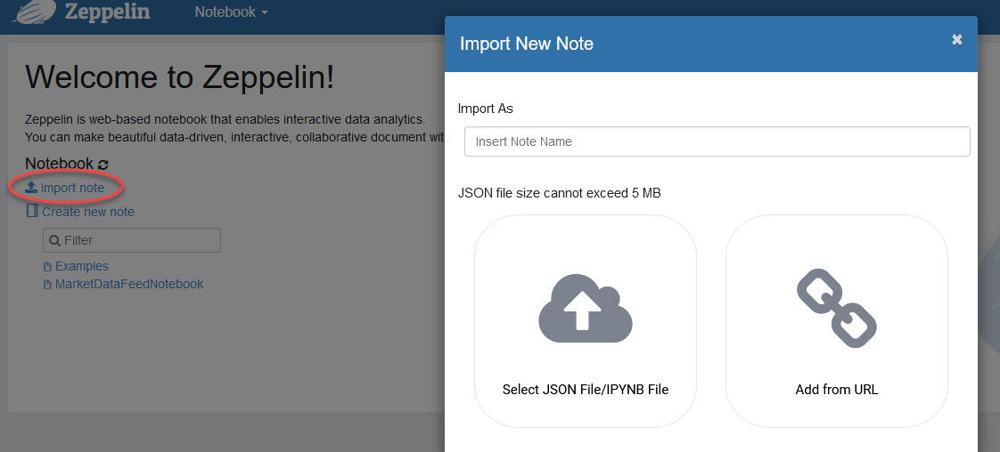

# Usage

1. You can use the CloudFormation template to create the following infrastructure:
 - Amazon Kinesis Data Streams
 - Amazon Kinesis Data Analytics Studio
 - Amazon Glue Database
 - Amazon S3 bucket
 - IAM roles and policies for Amazon Kinesis Data Analytics Studio to access appropriate resources

2. Once the CloudFormation is deployed, go to the Resources section of the Cloud Formation. All the deployed resources can ve viewed in this section.

 

3. Go to the Amazon Kinesis Dashboard from the AWS Console and click on  Streaming applications-Studio. The MarketDataFeedNotebook should be available. 

 

4. Open the Notebook and click on Run. It will take few minutes to make the notebook running.

5. Once the notebook is running, click on Open in Apache Zeppelin. That should open the Zeppelin notebook.

6. Once the notebook is opened, click on the import note and select the MarketDataFeedNotebook.zpln from the marketDataFeedNotebook folder.

7. After the notebook is imported, change the Amazon S3 bucket name with the new Amazon S3 bucket created by the CloudFormation.

