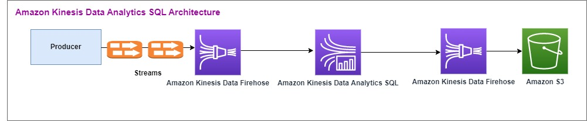
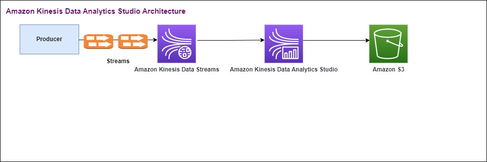

# Context

The purpose of the pattern is to demonstrate how to replace Amazon Kinesis Data Analytics SQL with Amazon Kinesis Data Analytics Flink and use Amazon Kinesis Data Streams instead of Amazon Kinesis Data Firehose.
Amazon Kinesis Data Analytics Studio and Amazon Kinesis Data Analytics for Apache Flink provide advanced analytical capabilities, including exactly-once processing semantics, event-time windows, extensibility using user defined functions and customer integrations, imperative language support, durable application state, horizontal scaling, support for multiple data sources, extensible integrations, and more. These are critical for ensuring accuracy, completeness, consistency, and reliability of data streams processing and are not available with Amazon Kinesis Data Analytics for SQL.
This Cloud Formation template focuses on Amazon Kinesis Data Analytics Studio, which allows you to interactively query data streams in real time using Apache Flink and easily build and run streams processing applications using standard SQL, Python, and Scala. It combines ease of use with advanced analytics capabilities, which makes it possible to build sophisticated stream processing applications in minutes. You can test your stream transformations interactively in a Zeppelin Notebook. Amazon Kinesis Data Analytics Studio provides features such as joining stream data between multiple Amazon Kinesis Data Streams, or between an Amazon Kinesis Data Streams and an Amazon MSK topic. It also supports real-time visualization of transformed data in a data stream. You can even combine SQL, python scripts, and Scala programs within the same application. 

# Use Case

Your objective is to change your data flow to use Amazon Kinesis Data Analytics Studio.  This will also mean switching from Amazon Kinesis Data Firehose to Amazon Kinesis Data Streams.

Here is the Amazon Kinesis Data Analytics SQL architectural flow:

Our objective is to update the  architecture. Here you will replace Amazon Kinesis Data Firehose with Amazon Kinesis Data Streams. Amazon Kinesis Data Analytics for SQL Applications will be replaced by Amazon Kinesis Data Analytics Studio. Apache Flink code is run interactively within an Apache Zeppelin Notebook. Amazon Kinesis Data Analytics Studio sends the aggregated trade data to an Amazon S3 bucket for storage. 

# Getting Started

1. In the environmentStackCfn, you will see the Cloud Formation template file (KdaStudioStack.template.yaml).
    1. You can use the CloudFormation template to create the following infrastructure:
        - Amazon Kinesis Data Streams
        - Amazon Kinesis Data Analytics Studio
        - Amazon Glue Database
        - Amazon S3 bucket
        - IAM roles and policies for Amazon Kinesis Data Analytics Studio to access appropriate resources

    2. Once the CloudFormation is deployed, go to the Resources section of the Cloud Formation. All the deployed resources can ve viewed in this section.

        

    3. Go to the Amazon Kinesis Dashboard from the AWS Console and click on  Streaming applications-Studio. The MarketDataFeedNotebook should be available. 

        

    4. Open the Notebook and click on Run. It will take few minutes to make the notebook running.

    5. Once the notebook is running, click on Open in Apache Zeppelin. That should open the Zeppelin notebook.

        

    6. Once the notebook is opened, click on the import note and select the MarketDataFeedNotebook.zpln from the marketDataFeedNotebook folder.

        

    7. After the notebook is imported, change the Amazon S3 bucket name with the new Amazon S3 bucket created by the CloudFormation.

        

