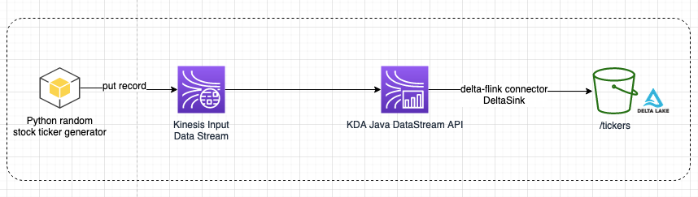
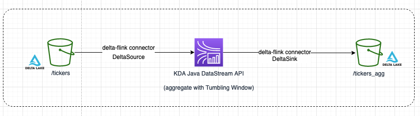

# Sample illustrating how to use delta-flink connector on Kinesis Data Analytics to load Delta tables

This example demonstrates how to sink data to Delta tables and source data from Delta tables using Kinesis Data Analytics with Flink. The example uses delta-flink connector which provides Java DataStream API to interact with Delta tables using flink.
There are two applications in this example.
1) Application 1 (DeltaSink directory) demonstrates sinking data from Kinesis data streams to Delta table using Kinesis Data Analytics with flink. The data is being appended to delta table, no upserts or overwrites is done. This is due to current limitations of delta-flink connector.
2) Application 2 (DeltaSource directory) demonstrates sourcing data from existing Delta table in a streaming fashion, aggregating data (max price per ticker) using event time processing with tumbling window and sinking it to another Delta table.  (Note: for the sake of this example sink location has been choosen as Delta table but it could be a different database such as, time series, opensearch etc)

## Architecture

Application 1 Architecture Diagram (Delta Sink)

Application 2 Architecture Diagram (Delta Source)

## Setup
<ol>
<li>Create a Kinesis data stream and start streaming random stock ticker data. Follow the instructions (https://docs.aws.amazon.com/code-library/latest/ug/kinesis-analytics-v2_example_kinesis-analytics-v2_DataGenerator_StockTicker_section.html)</li>
 
<li>Create an S3 bucket in the same region where Kinesis Data Analytics applications are running.
The bucket will be used to sink/source delta tables.

<li>Create 2 Kinesis Data Analytics Application.
 For the first application add following Runtime Properties.
Set group ID as FlinkApplicationProperties
<ol>
<li><b>StreamRegion</b> <i>Value of Kinesis Data Stream region</i></li>
<li><b>SourceStreamName</b> <i>Name of the Kinesis Data Stream</i></li>
<li><b>DeltaSinkPath</b> <i>S3 bucket path. Follow this format s3a://bucket_name/table_name</i></li>
 
</ol>

> #### Note: Delta Lake multi-cluster writes to Amazon S3
> First flink application uses Delta Lake multi-cluster writes to Amazon S3. 
>   To achieve this functionality Delta Lake maintains a DynamoDB table. Therefore, your Kinesis Data Analytics application should have permissions on the DynamoDB table along with other permissions (S3, Kinesis Streams).
>   This example relies on default behaviour in which DynamoDB table with "delta_log" name is created automatically.
> For more details about the mulit-cluster writes functionality see <https://delta.io/blog/2022-05-18-multi-cluster-writes-to-delta-lake-storage-in-s3/>.
>   Following DynamoDB IAM permissions will be necessary for the application to work:
>>dynamodb:CreateTable   dynamodb:DescribeTable   dynamodb:GetItem dynamodb:PutItem   dynamodb:Query

For the second application add following Runtime Properties. Set group ID for as FlinkApplicationProperties
<ol>
<li><b>DeltaSourceTablePath</b> <i>S3 bucket path for source Delta table. Follow this format s3a://bucket_name/table_name</i></li>
<li><b>DeltaSinkTablePath</b> <i>S3 bucket path for sinking aggregated data. Follow this format s3a://bucket_name/table_name_2</i></li>
</ol>
</li>
</ol>

## Build

Clone the repository.

Change directory to corresponding application directories DeltaConnector/DeltaSource or DeltaConnector/DeltaSink and build applications by executing following:

    mvn package -Dflink.version=1.15.4

After running the above command, you should see the built jar file under the target/ folder.
 

## Execute 
Place jar files into the chosen S3 bucket and configure Kinesis Data Analytics application code location to point to .jar file.

Start streaming data into Kinesis Data Stream and run first KDA application. After some minutes you should see parquet files and
_delta_log folder were created in the S3 location that was configured above (runtime properties).

Let first application run. Create another KDA application and configure its application code to point to .jar file that was 
built from /DeltaSource folder. Run second KDA application, after some minutes you should see parquet files and
_delta_log folder were created in the S3 location that was configured above (runtime properties).

## Resources
<https://delta.io/blog/2022-05-18-multi-cluster-writes-to-delta-lake-storage-in-s3/>
<https://github.com/delta-io/connectors/blob/master/flink/README.md>
