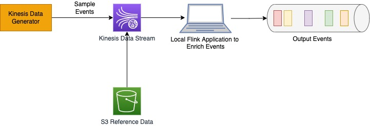

## Architecture
Use the Kinesis Data Generator to generate sample data to Kinesis stream. Flink application running on local Java IDE will consume the data and enrich it with reference data stored in different locations, for example a CSV format in S3.

 

| DISCLAIMER: In the sample code, to query the reference data from S3, we have used S3 Select. S3 Select can support upto 5,500 GET/HEAD requests per second per prefix in an Amazon S3 bucket. So if you have high volume of data flowing through KDA application for which you need to make more than 5500 concurrent request, its recommended to choose some other data store that can scale better.|
| --- |

 

## Setup

To use the Kinesis Data Generator to generate sample events, we need to setup the Cognito. Follow the instructions (https://awslabs.github.io/amazon-kinesis-data-generator/web/help.html) to create Cognito user pool required for Amazon Kinesis Data Generator along with instruction to setup the events.

Create a Kinesis Data Stream and S3 bucket in a region.

The sample event data in Kinesis Data Generator is generated using the following template -

    {
        "id": "{{random.number(1000)}}",
        "fname":"{{name.firstName}}",
        "lname":"{{name.lastName}}",
        "role":"{{random.arrayElement(["developer","accountant","logistics","front-office","back-office"])}}"
    }

The reference location data (`src/main/resources/location_data.csv`) we are using in the S3 for the sample code, looks like this -

    role,location
    developer,Building-I
    accountant,Building-II
    front-office,Building-III
    back-office,Building-IV
    logistics,Building-V

Copy the reference data in the newly created S3 bucket.

## Compile & Execute

Download the code and update the config file with Kinesis Data Stream name, S3 bucket name and region.

Compile it by executing

    mvn clean install

Execute the classes using the following command line

    java -cp target/event-data-enrichment-1.0-SNAPSHOT.jar com.amazonaws.ProcessStreamPreLoadReferenceDataInMemory

    java -cp target/event-data-enrichment-1.0-SNAPSHOT.jar com.amazonaws.ProcessStreamPreLoadReferenceData
    
    java -cp target/event-data-enrichment-1.0-SNAPSHOT.jar com.amazonaws.ProcessStreamPartitionPreLoadReferenceData

    java -cp target/event-data-enrichment-1.0-SNAPSHOT.jar com.amazonaws.ProcessStreamPeriodicPartitionPreLoadReferenceData
